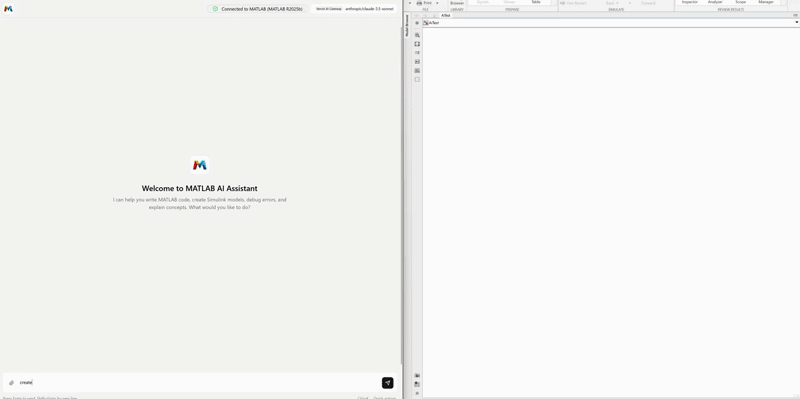
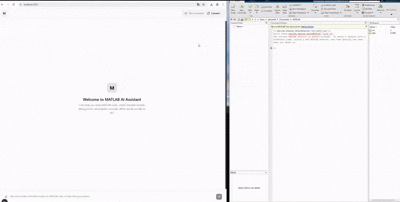
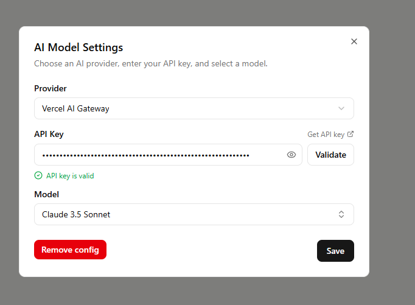

<p align="center">
  
</p>
<p align="center">
  Seamlessly connect your MATLAB session with an AI-powered web app ⚡
</p>
<p align="center">
  
  
  
  
</p>

---
<p align="center">
   
</p>
<!-- <p align="center">
  
</p> -->

## The Problem
Building advanced Simulink models is powerful, but the process is slow and repetitive. Manually connecting blocks, searching for the right ones, configuring parameters, and debugging structural issues takes significant time — time that should be spent on actual engineering.
While designing a torque sensor system, we ran into exactly this. Most of our effort went into boilerplate modeling and setup rather than core logic and validation.
MATLAB Bridge is our solution: an AI agent that handles the repetitive parts — inserting blocks, wiring connections, generating MATLAB code, restructuring models — so engineers can focus on designing and building better systems.

---
## Prerequisites
- MATLAB R2019a or later
- Python 3.11 
- Node.js 18+
  
---
## Setup
### 1. Install MATLAB Engine for Python

> **⚠️ Windows Users — Before proceeding:**
> 
> Open PowerShell **as Administrator** and run the following command to allow script execution:
> ```powershell
> Set-ExecutionPolicy -ExecutionPolicy RemoteSigned -Scope CurrentUser
> ```
> Also make sure to run your terminal or IDE **as Administrator** when performing the installation steps below.

Navigate to your MATLAB installation's Python engine directory :
Default paths (for example):
- **Windows:** `cd "C:\Program Files\MATLAB\R2024b\extern\engines\python"`
- **macOS:** `cd "/Applications/MATLAB_R2024b.app/extern/engines/python"`
- **Linux:** `cd "/usr/local/MATLAB/R2024b/extern/engines/python"`

and run
```bash
python -m pip install .
```
---

### 2. Start the Bridge Server
```bash
cd matlab-bridge
python -m venv venv
```
Activate the virtual environment:
```bash
# Windows
venv\Scripts\activate
# macOS/Linux
source venv/bin/activate
```
Install dependencies and start the server:
```bash
pip install -r requirements.txt
python server.py
```
---
### 3. Share Your MATLAB Session
In MATLAB, run:
```matlab
matlab.engine.shareEngine('MatlabBridge')
```
This lets the app connect to your running MATLAB instance.

---
### 4. Run the App
```bash
npm install
npm run build
npm start
```
Open [http://localhost:3000](http://localhost:3000) in your browser.

---
### 5. Configure AI Settings
1. Go to **AI Model Settings**
2. Enter your API key and choose a model
3. Save
<p align="center">
  
</p>

---
## Notes
- Intended for **local use only**
- Always start the bridge server **before** launching the app
